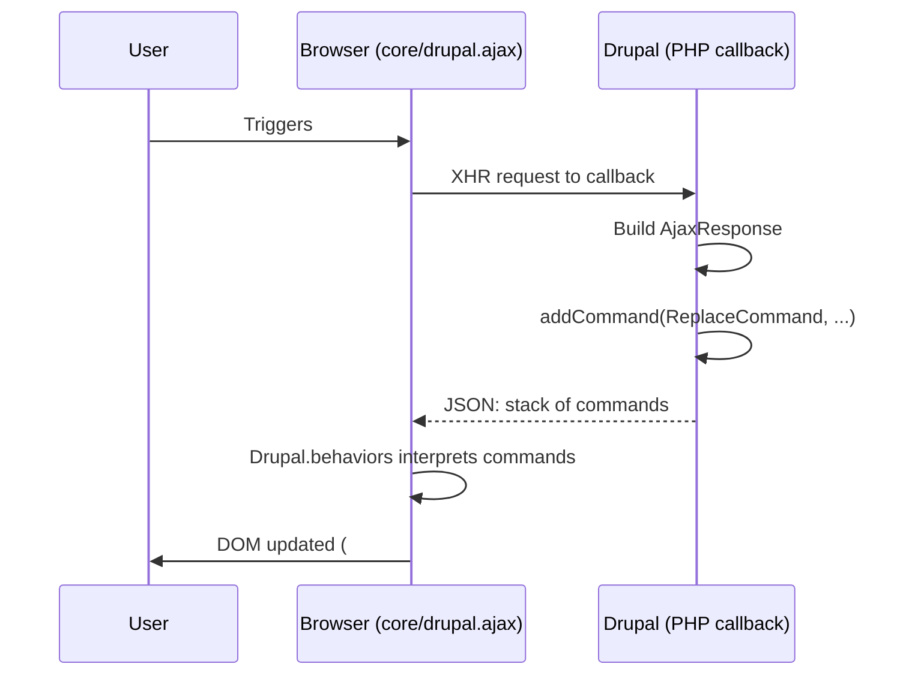
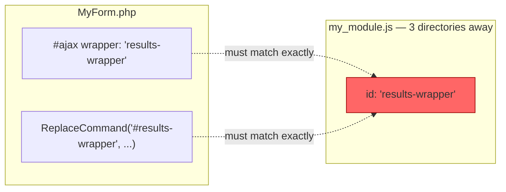

# Section 2: Ajax API — Evolution & Pain Points (6 min)

## [0:00–1:30] Evolution

"Drupal's Ajax API isn't new — it's been part of core in its current form since Drupal 7, unified under a single framework. In Drupal 8 through 11, it was rebuilt on top of Symfony's HttpKernel — `AjaxResponse` extends Symfony's `Response`, and interactions are expressed as a stack of Command objects. It's mature, well-documented, and used everywhere in core — exposed filters, autocomplete, modal dialogs, inline entity forms. This isn't a story about a broken system. It's a story about a system that was the right answer for 2011, and is starting to show its age."

## [1:30–3:30] How it works today

Mechanics:
- A form/render element gets an `#ajax` property: `callback`, `wrapper`, `event`.
- The callback runs server-side and returns an `AjaxResponse` built from one or more Commands.
- The client-side `core/drupal.ajax` library + `Drupal.behaviors` interpret those commands and mutate the DOM.



```php
$form['filter'] = [
  '#type' => 'select',
  '#ajax' => [
    'callback' => '::updateResults',
    'wrapper' => 'results-wrapper',
    'event' => 'change',
  ],
];

public function updateResults(array &$form, FormStateInterface $form_state) {
  $response = new AjaxResponse();
  $response->addCommand(new ReplaceCommand('#results-wrapper', $form['results']));
  return $response;
}
```

"Two files, two languages, and a wrapper ID string that has to match exactly in both places, or nothing happens — silently."

## [3:30–6:00] Where it breaks down



"One string, defined in two files, in two languages, with no compiler or linter checking they agree. Get it wrong, and nothing throws an error — it just silently doesn't work."

Four pain points (three from the abstract, plus discoverability):
- **JS coupling**: "Every custom interaction needs a matching pair — a PHP command on the server, a JS behavior on the client, often in different files, sometimes different modules."
- **Complexity**: "The command pattern is imperative — you're telling the DOM exactly what to do, command by command, instead of describing what the result should look like."
- **Maintenance overhead** — personal story: "I once spent 40 minutes in devtools debugging an Ajax response that updated one region but silently failed on another. The bug wasn't in the PHP, and it wasn't in the JS logic — it was a mismatched wrapper ID, one string, defined in a `.js` file three directories away from the PHP that built the response. Nothing threw an error. It just... didn't work." *(This is exactly the bug the diagram above illustrates.)*
- **Discoverability**: "None of this is visible in the markup. Look at the rendered HTML for that select element, and there's nothing telling you it's interactive — the behavior is buried in a PHP `#ajax` array and a JS file you have to go find. The element doesn't describe itself."

Close — tease the idea, don't name HTMX yet (save the reveal for the opening of §3): "So what if, instead of a PHP command and a matching JS behavior for every interaction, the element itself could just describe what it needs — 'when this changes, fetch this URL, and drop the result here'? No command classes, no wrapper-ID matching, no second file to go find. What would that even look like?"

*(pause, slide transition — §3 opens with the reveal: "That's not a hypothetical. It's called HTMX...")*

**[transition into §3]**

## Notes / open items
- Command example uses `ReplaceCommand` as the most common case — swap for `InvokeCommand`/`HtmlCommand` if a different illustration is preferred.
- History kept brief (90 sec) — not a standalone learning objective, just enough to establish the API is mature, not broken-by-design.
- Fourth pain point (discoverability) added into the same [3:30–6:00] window — that's now 4 beats in 2.5 min. Keep each to 1-2 sentences when scripting slides, or trim the maintenance-overhead story slightly, to avoid running over.
- Discoverability also sets up §3: it's the direct motivation for HTMX's markup-visible `hx-*` attributes, so the transition line was updated to nod at that.
