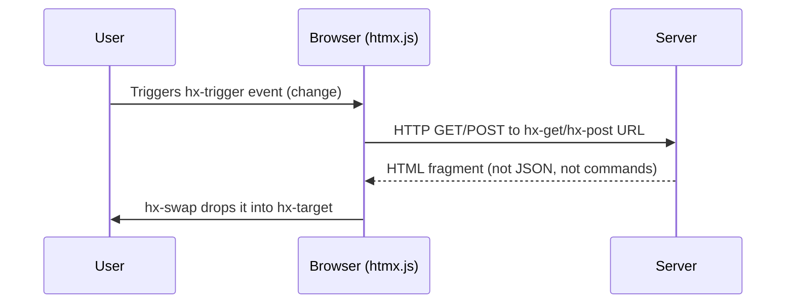

# Section 3: HTMX & Hypermedia Principles (6 min)

## [0:00–0:30] Reveal

Opens directly off §2's closing tease ("...the element itself could just describe what it needs?"):

"That's not a hypothetical. It's called HTMX — and it's built on an idea that's actually older than Ajax: hypermedia."

## [0:30–1:00] The hypermedia idea, in plain terms

"You already know hypermedia. Every `<a href>` and every `<form>` you've ever written is a hypermedia control — an element that tells the browser what to fetch and where to put the result. HTMX just extends that vocabulary: any element, any event, any HTTP verb, any part of the page as the target."

## [1:00–3:00] Core syntax — code + diagram

```html
<select hx-get="/filter-results"
        hx-trigger="change"
        hx-target="#results"
        hx-swap="innerHTML">
  ...
</select>

<div id="results">
  <!-- server returns just this fragment -->
</div>
```

"One element. Four attributes. The behavior lives right there in the tag — no PHP file to go find, no wrapper ID to keep in sync across two files." *(direct payoff of the discoverability pain point from §2)*



"Compare that to the version you saw ten minutes ago: same three participants — user, browser, server — but seven steps instead of four."

## [3:00–4:30] The bigger idea: server as the engine of application state

"There's no separate JSON API here, no client-side templating layer reconstructing HTML from data. The server decides what HTML comes back — same as it always has for the initial page load. HTMX isn't a new architecture. It's closing the gap between 'first page load' and 'everything after,' so both work the same way. That's what 'hypermedia-driven' means — the response *is* the next state of the UI, already rendered."

## [4:30–5:30] Cheat sheet — the four core attributes

Grid, mirroring the pain-points card layout from §2 for visual consistency:

- **Verb** — `hx-get` / `hx-post` / `hx-put` / `hx-delete`
- **Trigger** — `hx-trigger` — any DOM event, not just click/submit
- **Target** — `hx-target` — any element, not just "the one that triggered this"
- **Swap** — `hx-swap` — `innerHTML`, `outerHTML`, `beforeend`, `afterbegin`, and more

## [5:30–6:00] Transition into §4

"So HTMX gives Drupal back a vocabulary it never actually lost — hypermedia. The real question is how that maps onto Drupal's own architecture: render arrays, routing, caching. That's next."

## Notes / open items

- Kept this section framework-agnostic (plain HTML/generic endpoint), not Drupal-specific — §4 is explicitly where the Drupal mapping happens, so no duplication here.
- Explicitly pays off the discoverability pain point from §2, and references the sequence-diagram step count (7 steps vs. 4, same 3 participants) so this section lands as a direct answer rather than a fresh topic.
- Slide-deck note: per `CLAUDE.md`, this section's slides should switch the accent token from `--ajax` (cool blue) to `--htmx` (warm amber) to complete the color handoff the deck already sets up.
